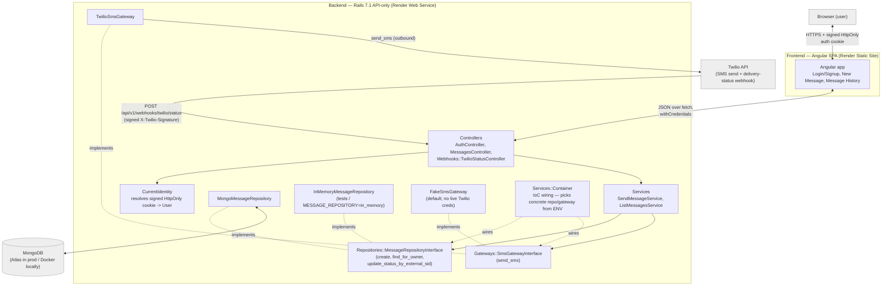
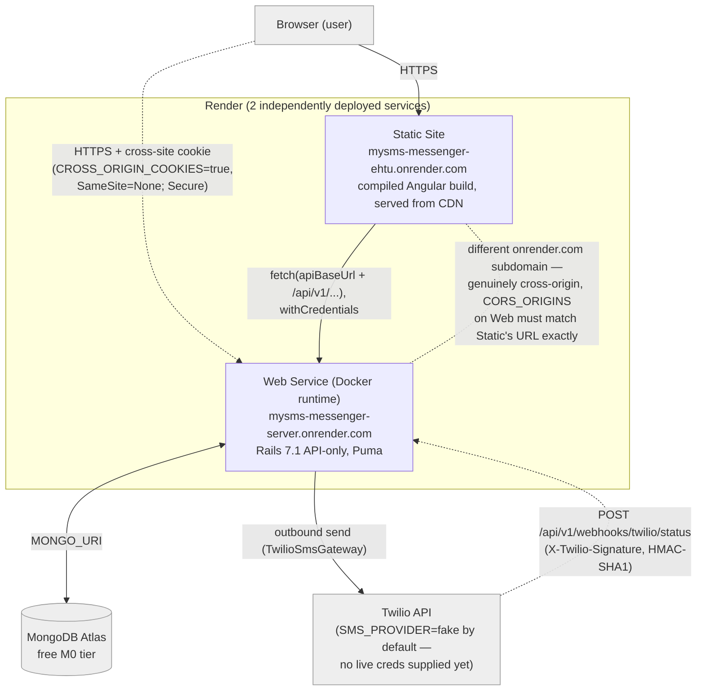

# MySMS Messenger — High-Level Design (HLD)

| | |
|---|---|
| **Project** | MySMS Messenger |
| **Client** | CityHive (Director: Nadav Gilron) |
| **Author** | Solutions Architect |
| **Status** | Draft for Tech Lead hand-off |
| **Document type** | High-Level Design (architecture only — no application code) |

---

## 1. Overview & Goals

MySMS Messenger is a full-stack web application that lets an **authenticated
user** send SMS messages and review the history of messages they have
previously sent. Users sign up and log in with a username + password; their
message history follows their account rather than a browser session. The
application is composed of an **Angular** single-page app (SPA), a **Ruby on
Rails** JSON API, a **MongoDB** datastore, and an outbound integration with
**Twilio** for SMS delivery.

### Primary goals

1. **Authenticate** users via username + password: sign up, log in, log out.
2. **Send** an SMS message through the backend API to an arbitrary phone number.
3. **Persist** every sent message in the database.
4. **List** previously sent messages via a dedicated listing API endpoint.
5. **Scope** the listing so a user sees only the messages associated with their
   own authenticated account.

### Architectural goals (the "how")

- **Swappable SMS provider.** The act of sending an SMS sits behind an interface
  so a stub gateway is used in dev/test and the real Twilio adapter is wired in
  by configuration alone — no code change.
- **Swappable datastore.** All persistence goes through a Data Access Layer
  (repository) abstraction so MongoDB can be relocated (local Docker → Atlas →
  another Mongo) or replaced entirely with config-only changes.
- **Testability as a first-class concern.** Both the SMS gateway and the DAL are
  dependency-injected/interface-based so unit tests substitute fakes without
  touching network or database.
- **Clean extension path (now fully cashed in).** Every bonus that earlier
  passes only left *seams* for is now implemented on those seams with no core
  rework: the identity abstraction carried real authentication (Bonus 1) with no
  change to Message storage or scoping, and — **new this pass** — the
  `status` + `external_sid` fields and the SMS Gateway seam carry **Twilio
  delivery-status webhooks (Bonus 3)** with **no schema migration** (see §5, §8).
- **Deploy-ready by construction.** Live cloud deployment (Bonus 2) is in scope
  this pass. Because everything is config-driven (§7.2), deploying is a matter of
  supplying production configuration to the hosting platform — not code changes —
  and it activates cross-origin design seams built earlier but never exercised
  until now (see §7.5).

---

## 2. Scope & Non-Goals

### In scope (this pass)

- **Real user authentication** (Bonus 1): sign up, log in, and log out with a
  username + password. Identity is a persisted `User`, not an anonymous session.
- Single-page UI matching the wireframe: "MY SMS MESSENGER" with a **New
  Message** panel (phone input, 250-char message box + live counter, Clear,
  Submit) and a **Message History (N)** panel (scrollable list; each item shows
  destination number, timestamp, bordered message body, and char count), plus
  login/signup/logout affordances.
- `POST` send endpoint and `GET` listing endpoint on the Rails API.
- Signup, login, and logout endpoints on the Rails API.
- Message persistence in MongoDB.
- Per-**user** ownership/scoping of the message list.
- Outbound SMS via a swappable gateway abstraction (stub now, Twilio later).
- Local MongoDB via `docker-compose` (development); **MongoDB Atlas free tier**
  as the managed datastore for the live deployment.
- **Live cloud deployment** (Bonus 2): the app is deployed to **Render** as two
  separate services (Rails API web service + Angular static site) backed by
  MongoDB Atlas, producing a fully functional public demo URL (see §7.5).
  (**Switched from an earlier Fly.io plan on 2026-07-15** — Fly.io now
  requires a credit card and has no meaningful free tier; Render's free Web
  Service and Static Site instances are genuinely $0/month, no card
  required.)
- **Twilio delivery-status webhooks** (Bonus 3): an **inbound webhook endpoint**
  that Twilio calls when a sent message's delivery status changes
  (`delivered`/`undelivered`/`failed`/etc.), authenticated by **Twilio request
  signature** (not the user cookie), which looks the message up by
  `external_sid` and updates its `status`. Built on the existing `status` +
  `external_sid` fields and the SMS Gateway seam — **no schema migration**
  (see §4.6, §5, §8). **Brought back into scope at the client's request**
  (2026-07-15) after being client-approved OUT earlier this engagement.

### Bonus feature scope (all three bonuses now in scope)

| # | Bonus feature | Deferred? | Status / notes |
|---|---|---|---|
| **Bonus 1** | User authentication | **No — in scope** | `has_secure_password` (bcrypt); signup/login/logout/me; `owner_id` re-pointed to a real `User` id with zero schema change (§4.5, §5, §6). |
| **Bonus 2** | Live cloud deployment | **No — in scope** | Deployed to **Render** (API web service + static-site frontend, two services) with **MongoDB Atlas** as datastore; enabled by the **12-factor / config-driven** design (§7). See §7.5 and §8. |
| **Bonus 3** | Twilio delivery-status webhooks | **No — now in scope** | Inbound webhook controller authenticated by **Twilio signature** (X-Twilio-Signature); looks the message up by **`external_sid`** and updates `status`. Built on the `status`/`external_sid` fields (§5) + SMS Gateway seam (§4.4/§4.6) — **no schema migration**. **Brought into scope 2026-07-15 at the client's request** (previously client-approved OUT). |

(**All three bonuses — user authentication (Bonus 1), live cloud deployment
(Bonus 2), and Twilio delivery-status webhooks (Bonus 3) — are now in scope this
pass** (see §4.5/§4.6, §5, §6, §7.5, §8). No bonus remains deferred.
**CORRECTION (2026-07-15):** an earlier revision of this document called Bonus 3
"the sole remaining deferred bonus" and directed the Tech Lead to build only
*seams* for it; the client has since asked for it to be implemented, so those
seams are now cashed in as a real endpoint this pass, exactly as Bonus 1 and
Bonus 2 were when each moved from deferred to in-scope.)

---

## 3. System Context

```
                 (1) HTTPS / JSON over fetch
  ┌──────────┐   + auth session cookie      ┌───────────────────────┐
  │ Browser  │ ───────────────────────────▶│  Angular SPA (static) │
  │ (user)   │◀─────────────────────────── │  served as assets     │
  └──────────┘                             └───────────┬───────────┘
                                                       │ (2) XHR / fetch
                                                       │     JSON + cookie
                                                       ▼
                                         ┌───────────────────────────┐
                                         │      Rails API (JSON)      │
                                         │  ┌──────────────────────┐  │
                                         │  │ Controllers          │  │
                                         │  │  ▼                   │  │
                                         │  │ Service / UseCase    │  │
                                         │  │  ├── DAL (repository) │──┼──▶ (3) MongoDB
                                         │  │  │   interface        │  │    (Docker / Atlas)
                                         │  │  └── SmsGateway        │──┼──▶ (4) Twilio API
                                         │  │      interface         │  │    (real adapter)
                                         │  └──────────────────────┘  │        or Stub (dev/test)
                                         └───────────────────────────┘
```

**Flows**

1. **Browser ⇄ Angular SPA** — the user interacts with the page; after login the
   SPA holds the auth session cookie (set by the API) and sends it on every
   request.
2. **Angular SPA ⇄ Rails API** — JSON requests: auth (signup/login/logout),
   `POST` to send, `GET` to list. Requests carry the auth cookie so the API can
   authenticate and scope results.
3. **Rails API ⇄ MongoDB** — all reads/writes go through the DAL abstraction,
   never Mongoid directly from controllers.
4. **Rails API → Twilio** — outbound SMS via the SMS Gateway abstraction; the
   concrete adapter (Twilio vs. Stub) is chosen by configuration.

**Diagram (2026-07-15 addition).** The same context, plus the component-level
seams from §4, as a Mermaid diagram — renders natively on GitHub, or view/edit
it at [mermaid.live](https://mermaid.live). Also saved standalone as
`doc/architecture-diagram.mermaid`.



---

## 4. Key Components & Responsibilities

### 4.1 Angular SPA (frontend)

- Renders the single-page UI per the wireframe (two side-by-side panels) plus
  login/signup views and a logout action.
- **New Message panel:** phone-number field, message textarea bound to a live
  `N/250` counter, a **Clear** action that resets the form, and **Submit** that
  calls the send API.
- **Message History (N) panel:** fetches and renders the scrollable list; the
  `(N)` header reflects the count; each row shows destination number, formatted
  UTC timestamp (e.g. `Sunday, 17-May-20 11:18:45 UTC`), the body in a bordered
  box, and a per-message `chars/250` count.
- Talks to a single API base URL taken from Angular environment config
  (config-driven; no hard-coded host).
- Sends requests with credentials enabled so the auth cookie round-trips.
- Redirects unauthenticated users to login; handles `401` responses by returning
  the user to the login view.
- Client-side validation (non-empty number, ≤250 chars) is a UX convenience;
  the server remains the source of truth.

### 4.2 Rails API layer (controllers)

- Exposes the JSON endpoints (§6), performs request validation, translates
  domain results into HTTP responses/status codes, and manages the auth session
  cookie.
- **Thin controllers**: no persistence, Twilio, or password logic inline. They
  delegate to a service/use-case object that receives its collaborators
  (repository, gateway, identity) via dependency injection.
- Reads the auth cookie, resolves it to the current `User`, and hands the
  resolved identity to the service layer. Rejects unauthenticated requests to
  protected endpoints with `401`.

### 4.3 Data Access Layer (repository abstraction)

- A `MessageRepository` **interface** defines the persistence contract
  (`create`, `find_for_owner`, etc.). Controllers/services depend on the
  interface, not on Mongoid.
- A `MongoMessageRepository` is the concrete implementation for this pass.
- **Why:** lets us (a) inject an in-memory fake for unit tests, and (b) relocate
  or replace the datastore with a config/wiring change only. The Mongo
  connection URI is read from an env var so local Docker → Atlas is config-only.

### 4.4 SMS Gateway abstraction

- An `SmsGateway` **interface** exposes a single conceptual operation:
  "send a message to a number and return a provider result".
- Concrete implementations:
  - **`StubSmsGateway`** — used in dev and tests; records the call, returns a
    deterministic fake result, sends nothing over the network. This unblocks the
    whole build while Twilio credentials are unavailable.
  - **`TwilioSmsGateway`** — the real adapter; reads account SID, auth token, and
    from-number from env vars.
- Selection is by configuration (env var such as `SMS_PROVIDER=stub|twilio`) so
  swapping providers is a wiring change, never a code change. This is the IoC
  seam the Tech Lead will formalize.

### 4.5 Authenticated identity concept

- A `CurrentIdentity` abstraction answers one question: **"who owns this
  request?"** In this pass it resolves to an authenticated **`User`**: the API
  reads a signed, HttpOnly cookie that carries the logged-in user's id and loads
  the corresponding `User`.
- The delivery mechanism to the browser is unchanged from the previous pass — a
  signed, HttpOnly cookie — **only what it identifies changes**: a real `User`
  id instead of a random, anonymous session UUID. No anonymous identity is ever
  minted; a request without a valid authenticated identity is rejected (`401`).
- The service layer stores this `User` id on each Message and filters the
  listing by it — this is what enforces requirement (5), per-user scoping.
- **Authentication mechanism (per exercise instruction — use a built-in/
  well-known mechanism, never hand-rolled):** use Rails/ActiveModel's
  **`has_secure_password`** (bcrypt-backed). It ships in Rails core (not a
  third-party gem needing separate vetting) and is the natural fit for an
  **API-only** app with no server-rendered forms. A full framework such as
  Devise is more than this needs and is harder to bolt onto API-only + Mongoid
  cleanly, so it is deliberately avoided.
- Because the rest of the system depends on `CurrentIdentity` — not on "the
  cookie" or "the session" directly — introducing the `User` was a change to
  *how identity is resolved*, not to how messages are stored or listed, exactly
  as the previous HLD promised.

### 4.6 Inbound delivery-status webhook (Bonus 3)

- **What it is.** A **single inbound webhook controller** that **Twilio** calls
  (server-to-server, not the browser) each time a previously sent message's
  delivery status changes — e.g. from `sent` to `delivered`, `undelivered`, or
  `failed`. This is the read-back half of the SMS Gateway seam (§4.4): the
  outbound `TwilioSmsGateway#send_sms` hands Twilio a **status-callback URL**
  pointing at this endpoint, and Twilio POSTs status updates back to it.
- **How it authenticates — NOT the user cookie.** Twilio is a third party and
  **cannot hold a signed session cookie**, so the existing `CurrentIdentity`
  cookie gate does **not** apply here (mirroring how `HealthController` opts out
  of that gate). Instead the endpoint authenticates the *caller* by validating
  **Twilio's request signature** (the `X-Twilio-Signature` header, an HMAC-SHA1
  over the exact callback URL + POST params, keyed by the account's
  `TWILIO_AUTH_TOKEN`). A request whose signature does not verify is rejected;
  the endpoint is therefore public-by-routing but **not** an open,
  anyone-can-write status mutator.
- **How the message is looked up.** By **`external_sid`** — the provider message
  id (Twilio SID) already stored on each Message at send time (§5). The webhook
  reads Twilio's `MessageSid`, finds the one Message with that `external_sid` via
  the repository, and updates its `status`. **Terminology note:** earlier
  revisions of this document called this field `provider_message_id`; it is
  named **`external_sid`** in the actual code and data model, and this document
  is now **aligned to that real name** throughout (§5).
- **What it writes.** Only the `status` field (and the audit `updated_at`). The
  update is keyed by `external_sid`, so an unknown/unmatched SID is a **safe
  no-op**, and a duplicate callback (Twilio may deliver the same status more than
  once) is **idempotent by construction** — it re-writes the same value.
- **No cookie, no user scoping here.** Unlike the message endpoints, this
  endpoint is not scoped to a `User`; the Twilio signature *is* its
  authorization. It never reads or trusts an `owner_id` from the caller.

---

## 5. Data Model Overview

Two entities this pass: **User** and **Message**.

### User

| Field | Type | Purpose |
|---|---|---|
| `id` | ObjectId / string | Primary key; this is the value used as a Message's `owner_id`. |
| `username` | string (unique) | Login identifier. |
| `password_digest` | string | Bcrypt hash produced by `has_secure_password`. **Never stores plaintext.** |
| `created_at` | timestamp (UTC) | Standard audit field. |
| `updated_at` | timestamp (UTC) | Standard audit field. |

Notes:
- `username` is uniquely indexed.
- No plaintext password is ever persisted, and the `password` virtual attribute
  is never logged (see §7.3).

### Message

| Field | Type | Purpose |
|---|---|---|
| `id` | ObjectId / string | Primary key. |
| `to_number` | string | Destination phone number. |
| `body` | string (≤250 chars) | Message text. |
| `owner_id` | string | The `CurrentIdentity` value — **now a real `User` id** (previously an anonymous session id). Same field, same type; **no schema migration needed**, exactly as this document previously promised. **The scoping key.** |
| `status` | string | Delivery status. Set synchronously at send time to `sent` (gateway accepted) or `failed` (gateway rejected), and **now updated by the Bonus 3 webhook** to `delivered`/`undelivered`/`failed` when Twilio reports the final delivery outcome. Stored as a plain `String` (not a hard DB enum), so new values need no migration. |
| `external_sid` | string, nullable | Provider-assigned message id returned by the gateway (the **Twilio SID**, e.g. `SM…`; a `SM<hex>` fake id from `FakeSmsGateway`). **This is the key the delivery-status webhook (§4.6) looks a message up by.** (**CORRECTION:** earlier revisions named this field `provider_message_id`; the real code/field name is **`external_sid`** and this document is now aligned to it.) |
| `created_at` | timestamp (UTC) | When the message was created; drives the history timestamp display. |
| `updated_at` | timestamp (UTC) | Standard audit field; **the delivery-status webhook update touches this**. |

Notes:
- `owner_id` is indexed to make the scoped listing query efficient.
- `owner_id` now references a `User` id; because it was already an opaque owner
  identifier, pointing it at a real user is a semantic change only — no field or
  index change.
- `status` and `external_sid` were previously described as inert placeholders;
  **as of this pass they are live** — `external_sid` is the webhook lookup key
  and `status` is mutated by the inbound webhook (§4.6, Bonus 3). This is
  achieved with **no schema migration**, exactly as this document promised while
  the fields were still placeholders.
- **Status vocabulary.** The `status` field stores one of
  `queued` / `sent` / `failed` / `delivered` / `undelivered`. `sent`/`failed`
  are set at send time; `delivered`/`undelivered`/`failed` arrive via the
  webhook. Twilio's transient intermediate values (`sending`, and `queued` as a
  callback value) are **not** persisted as status transitions — the webhook
  ignores any status outside the stored vocabulary (safe no-op). The Tech Lead's
  §15 fixes the exact list and mapping.

---

## 6. API Surface (high level)

Detailed request/response schemas and concrete endpoint design are the Tech
Lead's responsibility. At the architecture level there are two authentication
endpoints and two message endpoints:

| Method | Path (indicative) | Purpose | Auth / Scoping |
|---|---|---|---|
| `POST` | `/api/signup` | Create a `User` (username + password); persist a bcrypt `password_digest`. | Public. |
| `POST` | `/api/login` | Authenticate username + password; on success issue the signed, HttpOnly auth cookie. | Public; rate-limited (§7.3). |
| `DELETE` | `/api/logout` (or `POST`) | End the session; clear the auth cookie. | Requires authentication. |
| `POST` | `/api/messages` | Send an SMS: validate input, invoke the SMS Gateway, persist the resulting Message. | **Requires auth**; stamps the new record with the current user id. |
| `GET` | `/api/messages` | List previously sent messages for the history panel (typically newest-first). | **Requires auth**; returns **only** records whose `owner_id` matches the current user. |
| `POST` | `/api/…/webhooks/twilio/status` (indicative) | **Inbound Twilio delivery-status webhook (Bonus 3, §4.6).** Twilio POSTs a status change; the endpoint looks the message up by `external_sid` and updates `status`. | **Not cookie-authed** — authenticated by **Twilio request signature** (`X-Twilio-Signature`). No user scoping; the signature is the authorization. |

- The two **message** endpoints now **require authentication**: an
  unauthenticated request receives `401` instead of the API silently minting an
  anonymous identity.
- The **webhook** endpoint is deliberately outside the user-cookie auth model
  (Twilio can't carry a cookie); it opts out of the `CurrentIdentity`
  before-action (as `HealthController` does) and validates the Twilio signature
  instead. It never trusts a caller-supplied `owner_id` (§4.6, §7.3).
- Responses are JSON. Standard HTTP status codes convey success/validation/error.

---

## 7. Non-Functional Requirements

### 7.1 Testability (first-class)

- The **DAL** and **SMS Gateway** are interface-based and dependency-injected, so
  unit and service tests run against in-memory/stub collaborators — no live
  database or network, fast and deterministic.
- Thin controllers + a service/use-case layer keep business logic in plain,
  easily unit-testable objects.
- The Stub SMS gateway means the full send flow is testable today without Twilio
  credentials.
- Authentication is testable through the same seams: the identity resolution is
  a collaborator, and `has_secure_password` behavior is standard, well-covered
  Rails core.

### 7.2 Config-driven environment (12-factor)

- All environment-specific values — Mongo URI, SMS provider selection, Twilio
  credentials, API base URL, allowed CORS origins, cookie/signing secret — come
  from environment variables, never hard-coded. This is what makes
  datastore/provider swaps and future deployment config-only.
- Local MongoDB runs via `docker-compose`; the app reads the same `MONGO_URI`
  variable regardless of whether Mongo is local Docker or Atlas.

### 7.3 Security posture

- **Password hashing:** passwords are hashed with **bcrypt** via
  `has_secure_password`; plaintext passwords are **never stored** and **never
  logged** (filter the `password`/`password_confirmation` params from logs).
- **Brute-force protection on login:** the login endpoint is rate-limited by
  **extending the existing rack-attack approach** already used for the send-SMS
  endpoint (e.g. throttle by IP and by username) to blunt credential-stuffing.
- **Authentication required:** all existing message endpoints now require a
  valid authenticated identity and return `401` when absent — no anonymous
  identity is ever minted.
- Auth session cookie is **signed/HttpOnly** and, in deployed environments,
  `Secure` + appropriate `SameSite`.
- **CORS** restricted to the known SPA origin(s) via the `CORS_ORIGINS` config
  variable, which in the live deployment **must** be set to the real deployed
  frontend origin (the Render static site URL) — not `localhost` — via platform
  config.
- Server-side input validation (phone format, ≤250 chars, username/password
  rules) — client validation is UX only.
- Secrets (`SECRET_KEY_BASE`, `MONGO_URI`, `CROSS_ORIGIN_COOKIES`, and any Twilio
  credentials) are **never committed and never baked into a Docker image layer**;
  they are supplied via the hosting platform's secret store (Render dashboard
  environment variables, `sync: false` in `render.yaml`).
- Scoping by `owner_id` (now a `User` id) prevents one user from reading
  another user's messages.
- **Inbound Twilio webhook (Bonus 3, §4.6) is a public-by-routing endpoint and
  is treated as hostile-by-default.** It is **not** cookie-authenticated (Twilio
  can't carry a cookie), so it must **not** allow arbitrary status writes from
  anyone but Twilio. Controls: (a) **Twilio request-signature validation**
  (`X-Twilio-Signature`, HMAC-SHA1 over the callback URL + params, keyed by
  `TWILIO_AUTH_TOKEN`) rejects any caller that can't prove it is Twilio; (b) the
  endpoint **only ever updates `status` looked up by `external_sid`** — it never
  creates records and never trusts a caller-supplied `owner_id`; (c) **replay /
  idempotency** — because the write is an update keyed by `external_sid`,
  Twilio's documented at-least-once redelivery is harmless (a replay re-writes
  the same value); (d) if the signing secret is absent (the current
  `SMS_PROVIDER=fake` posture, no live Twilio credentials), the endpoint is
  **disabled and rejects everything** rather than silently accepting unsigned
  requests — so flipping `SMS_PROVIDER=twilio` without a real token can never
  quietly open an unauthenticated status-write hole; (e) it can be rack-attack
  rate-limited (matching the send/login/signup pattern) to blunt abuse from
  non-Twilio sources before signature validation even runs. Exact mechanics are
  fixed in `doc/tech-design.md` §15.

### 7.4 Scalability

- The Rails API is **stateless** apart from the auth cookie, so it scales
  horizontally behind a load balancer.
- `owner_id` is indexed for efficient scoped listing; listing can adopt
  pagination if history grows large.
- Outbound SMS is synchronous now; the gateway seam allows moving sends to a
  background job/queue later without changing callers.
- MongoDB scaling (replica set / Atlas tier) is an infrastructure/config concern,
  isolated behind the DAL.

### 7.5 Production deployment topology (Bonus 2)

The live demo runs on **Render** with **MongoDB Atlas** as the datastore.
(**Switched from an earlier Fly.io plan on 2026-07-15**: Fly.io requires a
credit card on every new org with no meaningful free tier; Render's free Web
Service and Static Site instances are genuinely $0/month with no card
required — see `doc/tech-design.md` §14 intro for the full rationale and
trade-offs, notably that the free web service spins down after 15 min idle.)
Three independently managed pieces:

- **Rails API service** — one Render **Web Service** (Docker runtime) running
  the API-only Rails image (e.g. `mysms-messenger-api.onrender.com`).
- **Angular frontend** — a Render **Static Site** serving the compiled SPA
  build directly from Render's CDN (e.g. `mysms-messenger-web.onrender.com`)
  — no container/nginx needed for the frontend at all. API and frontend are
  deployed as **separate services** because they are different runtimes /
  build outputs; both are declared together in one `render.yaml` Blueprint.
- **MongoDB Atlas (free tier)** — a managed database, **decoupled from app
  hosting**; the API reaches it via `MONGO_URI` (§7.2). Local `docker-compose`
  Mongo remains for development only.

**Genuine cross-origin deployment.** The API and frontend live on **different
`onrender.com` subdomains**, so the SPA-to-API auth cookie is now a **real
cross-site cookie**. This is *exactly* the scenario `CurrentIdentity`'s
existing **`CROSS_ORIGIN_COOKIES`** env flag (which sets the auth cookie to
`SameSite=None; Secure`) was built for in the earlier pass and **never
activated until now** — flipping it on in production is the real payoff of
that earlier design decision, **not new design debt**. This holds regardless
of which hosting provider is used.

**HTTPS is mandatory** in this topology. Render terminates TLS by default
(same as Fly did), and `config.force_ssl = true` is already set in
`production.rb`, so all traffic is HTTPS end-to-end — which is also a
precondition for the `Secure` cookie above.

**Secrets** (`SECRET_KEY_BASE`, `MONGO_URI`, `CROSS_ORIGIN_COOKIES`, plus Twilio
credentials if/when supplied) are set through the Render dashboard's
environment variables (`sync: false` entries in `render.yaml`) — never
committed to the repo, never baked into a Docker image layer (§7.3).

**SMS stays on the fake gateway in production.** No real Twilio credentials have
been supplied, so the demo runs with the **Stub SMS gateway**. `SMS_PROVIDER`
already **defaults to the fake gateway** and is **config-only** to flip later
(§4.4); **no code assumes real Twilio**, so the live demo is fully functional
end-to-end without sending real SMS.

**CORS** (`CORS_ORIGINS`) is set on the API to the deployed frontend origin
(`mysms-messenger-web.onrender.com`), not `localhost` (§7.3).

**Diagram (2026-07-15 addition).** The actual live topology — real deployed
hostnames, not the `render.yaml` placeholder names above (see that file's own
drift note, added during the 2026-07-15 bug blitz, for why they differ). Also
saved standalone as `doc/deployment-diagram.mermaid`.



---

## 8. Bonus Features Delivered on the Existing Seams (without major rework)

> **All three bonuses are now implemented in this pass** — Bonus 1 (user
> authentication, §4.5/§5/§6/§7.3), Bonus 2 (live cloud deployment, §7.5), and
> — **new this pass** — Bonus 3 (Twilio delivery-status webhooks, §4.6/§5/§6/
> §7.3). **No bonus remains deferred.** Each was delivered by *cashing in* a
> seam an earlier pass deliberately left, with **no core rework and no schema
> migration** — exactly as this document repeatedly promised.

### Bonus 2 — Live cloud deployment (now in scope, see §7.5)

- Delivered via **Render** (Rails API web service + Angular static site as two
  separate services, declared in one `render.yaml` Blueprint) with **MongoDB
  Atlas (free tier)** as the datastore — full topology in §7.5.
- Because everything is config-driven (§7.2), deploying is providing production
  configuration (Mongo URI → Atlas, secure/cross-origin cookie flags via
  `CROSS_ORIGIN_COOKIES`, `CORS_ORIGINS` → the frontend origin, `SECRET_KEY_BASE`)
  — **not code changes**. `SMS_PROVIDER` keeps its fake default for the demo.
- The backend Dockerfile, `render.yaml`, and CI/CD wiring are the Tech Lead's /
  dev team's deliverables; this HLD fixes the architecture and configuration
  surface only.

### Bonus 3 — Twilio delivery-status webhooks (now in scope, see §4.6)

- **Delivered on the pre-existing seams.** The Message entity already carried
  `status` and `external_sid` (§5), and the SMS Gateway abstraction (§4.4) was
  built to later carry a callback URL — both are now used for real, with **no
  schema migration and no change to the send/list flows or the data shape**.
- **Outbound side.** `TwilioSmsGateway#send_sms` now passes a **status-callback
  URL** to Twilio (from an env var, since the backend's own public URL isn't
  otherwise known to itself). `FakeSmsGateway` needs no callback (it never
  really sends, so no callback will ever fire).
- **Inbound side.** **One** new inbound webhook controller (its own route/
  namespace, not bolted onto `MessagesController`) that Twilio POSTs to; it
  **validates the Twilio request signature** (not the user cookie — §4.6/§7.3),
  looks the message up by **`external_sid`** via the repository, and updates
  `status`. An unmatched SID is a safe no-op; redelivery is idempotent.
- **Repository gets one new method.** The `MessageRepository` interface gains an
  update-status-by-`external_sid` operation, implemented by both the Mongo and
  in-memory repositories — the only DAL change, and additive.
- **Honest caveat (same posture as `TwilioSmsGateway` itself, §9).** Because no
  live Twilio credentials have been supplied yet (`SMS_PROVIDER=fake`), this
  endpoint is fully implemented and unit-tested but **cannot be verified against
  a real Twilio callback this pass** — while the signing secret is absent the
  endpoint is disabled (rejects everything), so it is safe by default until
  credentials exist. Exact implementation is fixed in `doc/tech-design.md` §15.

---

## 9. Risks, Open Questions & Assumptions

### Assumptions

- Identity = an authenticated `User` (username + password); message history
  follows the account and is now available across devices/browsers after login.
- Twilio credentials are unavailable now; the **Stub gateway is the default** and
  the app is fully demonstrable end-to-end without real SMS delivery.
- 250-character limit applies to the message body and is enforced server-side.
- Timestamps are stored and displayed in UTC (matching the wireframe format).
- "Latest stable" Angular and a current Rails API-only app are the target
  runtimes.

### Open questions (for client / Tech Lead)

- Password policy: minimum length/complexity, and any username format rules?
- Session lifetime / expiry: how long should a login remain valid; any
  "remember me" behavior?
- Should the `POST` persist a message even if the gateway send fails, or only on
  success? (Affects how `status` is initialized.)
- Any phone-number format/validation rules or country constraints?
- Expected history volume — is pagination needed in this pass or deferred?
- Should the history list auto-refresh after a send, or is optimistic
  client-side append acceptable?
- Rate-limiting thresholds for both login and the send-SMS endpoint.

### Risks

- **Twilio integration untested** until credentials arrive — mitigated by the
  gateway seam, but the real adapter must be integration-tested before any live
  use (SMS incurs cost and has deliverability nuances). **This now covers the
  Bonus 3 delivery-status webhook (§4.6) as well:** the endpoint is fully
  implemented and unit-tested (signature validation, disabled-when-unconfigured,
  unknown-SID no-op, idempotent replay), but — exactly like `TwilioSmsGateway` —
  it **cannot be verified against a live Twilio callback this pass** because no
  real credentials or callback URL exist yet. Until then the endpoint is
  **disabled by default** (rejects everything while `TWILIO_AUTH_TOKEN` is
  blank), so the unverified path is also inert-and-safe, not open. It must be
  smoke-tested against a real Twilio status callback once credentials are
  supplied.
- **Cost/abuse exposure** once real sending is enabled — mitigated by
  authentication (now in scope) plus rate limiting on send.
- **Deployment risk (first real deploy).** This is the **first time the app runs
  anywhere the sandbox that built it could not reach** — `rubygems.org` was
  blocked in that build environment throughout — so some environment-specific
  surprises (dependency fetch, image build, Atlas connectivity, cookie/CORS
  behavior across the two Render services) are possible on the first real
  deploy. Same
  pattern as the earlier live local run; mitigated by the config-driven design
  and by treating the first deploy as a shakeout.
- **Pre-existing anonymous messages** created before this change carry an
  `owner_id` that is a session UUID rather than a real `User` id, so they will
  not be visible to any account. This is a **known one-time data consideration**;
  because the app is **pre-launch** it is accepted as-is and **not** something to
  resolve retroactively (any such records can simply be discarded when the store
  is reset). No migration is planned.
